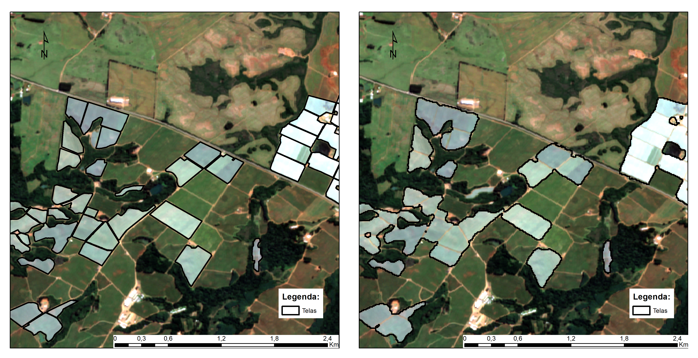
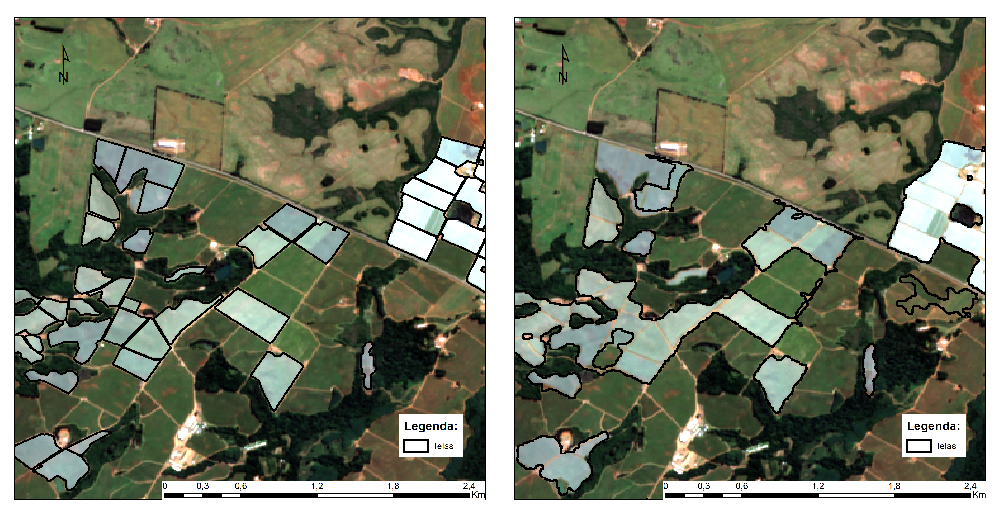

# Anti-Hail Net Mapping in Apple Orchards

Mapping of anti-hail nets in apple orchards using Sentinel-2
satellite imagery and machine learning.

## Overview

This project investigates the use of Sentinel-2 satellite imagery
for detecting anti-hail nets in apple orchards in southern Brazil.

## Methodology

- Sentinel-2 multispectral imagery
- Google Earth Engine
- K-means segmentation
- Random Forest classification
- 800 reference sample points

## Study Area

Apple-producing regions in Rio Grande do Sul, Brazil.

## Results

Figure 1. Visual vectorization; Pixel-based Random Forest classifier.

Figure 2. Visual vectorization; Object-Based Image Analysis (OBIA) Random Forest classifier.

## Technologies

Python | Google Earth Engine | scikit-learn | Rasterio | NumPy
